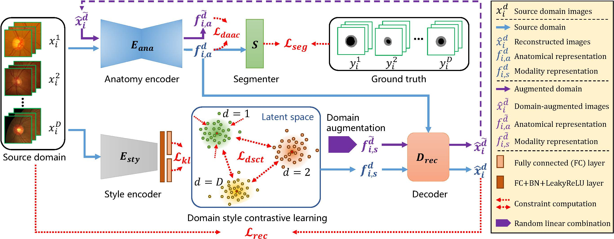

# Domain Adaptation and Generalization for Medical Image Analysis

## Experimental Requirements
Some important required packages include:
* [Pytorch][torch_link] version >= 1.8.0.
* TensorboardX
* Python == 3.8 
* Some basic python packages such as Numpy.

Follow official guidance to install [Pytorch][torch_link].

[torch_link]:https://pytorch.org/


## 1. Contrastive Semi-supervised Learning for Domain Adaptive Segmentation Across similar Anatomical Structures
This repository provides the official code for "[Contrastive Semi-supervised Learning for Domain Adaptive Segmentation Across similar Anatomical Structures][paper1_link]".

[paper1_link]:https://ieeexplore.ieee.org/abstract/document/9903480

<center></center>
<center>Fig. 1. Flowchart of CS-CADA.</center>

### Usages
#### For circular structure segmentation
1. First, you should download the retinal dataset at [REFUGE Challenge][data1_link]. We only used the 360 non-glaucoma images in this dataset and central-cropped and resized the images to 256. Second, you should download the CMR dataset at [MS-CMRSeg 2019][data2_link]. We only used the bSSFP-sequence dataset and splited the 3D volumes into slice, and also central cropped and resized to 256.

[data1_link]:https://refuge.grand-challenge.org/
[data2_link]:http://www.sdspeople.fudan.edu.cn/zhuangxiahai/0/mscmrseg19/index.html


2. To train CS-CADA in circular structure segmentation, run:
```
python train_cscada.py
```

3. To evaluate the trained model in CMR images for Left Ventricle (LV) and left ventricular Myocardium (Myo) segmentaiton, run:
```
python test_cscada_mscmrseg.py
```
### Citation
If this project is helpful for your research, please cite the following works:
```
@article{gu2022contrastive,
  title={Contrastive Semi-supervised Learning for Domain Adaptive Segmentation Across Similar Anatomical Structures},
  author={Gu, Ran and Zhang, Jingyang and Wang, Guotai and Lei, Wenhui and Song, Tao and Zhang, Xiaofan and Li, Kang and Zhang, Shaoting},
  journal={IEEE Transactions on Medical Imaging},
  volume={42},
  number={1},
  pages={245--256},
  year={2023},
  publisher={IEEE}
}
@inproceedings{zhang2021ss,
  title={SS-CADA: A semi-supervised cross-anatomy domain adaptation for coronary artery segmentation},
  author={Zhang, Jingyang and Gu, Ran and Wang, Guotai and Xie, Hongzhi and Gu, Lixu},
  booktitle={2021 IEEE 18th International Symposium on Biomedical Imaging (ISBI)},
  pages={1227--1231},
  year={2021},
  organization={IEEE}
}
```

### Acknowledgement
Part of the code is revised from [UA-MT][uamt].

[uamt]:https://github.com/yulequan/UA-MT

## 2. CDDSA: Contrastive Domain Disentanglement and Style Augmentation for Generalizable Medical Image Segmentation
This repository provides the official code for "[CDDSA: Contrastive Domain Disentanglement and Style Augmentation for Generalizable Medical Image Segmentation][paper2_link]". We first released our train and test codes.

[paper2_link]:https://arxiv.org/abs/2211.12081

<center></center>
<center>Fig. 1. Flowchart of CDDSA.</center>

### Usages
#### For fundus image segmentation
1. First, you should download the fundus dataset collected by Shujun Wang et al at [DoFE project][data3_link]. We referenced the dataloader from this project and followed their training settings. 

[data3_link]:https://drive.google.com/file/d/1p33nsWQaiZMAgsruDoJLyatoq5XAH-TH/view

2. To train CDDSA in fundus image segmentation, run:
```
python train_cddsa.py
```

3. To evaluate the trained model in other domain for Optic Cup (OC) and Disc (OD) segmentaiton, run:
```
python test_cddsa_fundus.py
```

### Citation
If this project is helpful for your research, please cite the following works:
```
@article{gu2022cddsa,
  title={CDDSA: Contrastive Domain Disentanglement and Style Augmentation for Generalizable Medical Image Segmentation},
  author={Gu, Ran and Wang, Guotai and Lu, Jiangshan and Zhang, Jingyang and Lei, Wenhui and Chen, Yinan and Liao, Wenjun and Zhang, Shichuan and Li, Kang and Metaxas, Dimitris N and others},
  journal={arXiv preprint arXiv:2211.12081},
  year={2022}
}
@inproceedings{gu2021domain,
  title={Domain Composition and Attention for Unseen-Domain Generalizable Medical Image Segmentation},
  author={Gu, Ran and Zhang, Jingyang and Huang, Rui and Lei, Wenhui and Wang, Guotai and Zhang, Shaoting},
  booktitle={International Conference on Medical Image Computing and Computer-Assisted Intervention},
  pages={241--250},
  year={2021},
  organization={Springer}
}
```

### Acknowledgement
Part of the code is revised from [DoFE][dofe] and [SDNet][sdnet].

[dofe]:https://github.com/emma-sjwang/Dofe
[sdnet]: https://github.com/agis85/anatomy_modality_decomposition